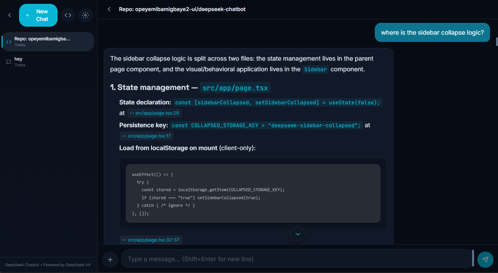

# DeepSeek Chatbot 🤖

A production-quality AI chatbot web application powered by **DeepSeek V4 Pro**, built with Next.js 16, TypeScript, and Tailwind CSS. Features a standout **repo-aware RAG chat** that lets you import a public GitHub repository and ask questions about the actual codebase, with answers citing specific files and line numbers.



## Repo-Aware Code Chat 🔍

The headline feature: import any public GitHub repository and ask questions about its codebase. The app fetches and indexes the repo's source files, then uses context-stuffing (leveraging DeepSeek V4's large context window) to answer questions with precise, verifiable citations.

- **Import a repo** — paste a GitHub URL, the app fetches all source files via the GitHub REST API, filters out binaries and generated code, and indexes the rest
- **Ask questions** — "Where is authentication handled?" or "How does the rate limiter work?" — the model answers using the actual repo content as context
- **Clickable citations** — every answer references specific files and line numbers (e.g. `[src/auth.ts:42-58]`). Click any citation to open a slide-over panel showing the exact code snippet with syntax highlighting and a "View on GitHub" link
- **Smart context selection** — keyword-based chunk scoring selects the most relevant files for each question, respecting a configurable token budget

## Features

- 🔍 **Repo-aware chat** — Import a GitHub repo and get cited answers about its codebase (see above)
- 💬 **Real-time streaming** — Responses stream token-by-token via SSE, no full-response waiting
- 📝 **Markdown rendering** — Full markdown support with syntax-highlighted code blocks, lists, tables, and more
- 🧵 **Multiple conversations** — Sidebar with thread management: create, rename, delete chats. Repo threads are visually distinguished with a code icon
- 💾 **Persistent history** — All chats saved to IndexedDB in your browser (no backend database needed)
- 🌙 **Dark mode** — Light/dark/system theme toggle with smooth transitions and a custom cyan/teal design system
- 📋 **Copy to clipboard** — One-click copy for any assistant message
- 🔄 **Regenerate** — Regenerate the last assistant response
- ⚙️ **Custom system prompt** — Configure the AI's personality via Settings panel
- 📎 **File attachments** — Attach code/text files to messages via the "+" button for extra context
- 🔽 **Scroll-to-bottom** — Floating button appears when you scroll up, letting you jump back to the latest message
- 📱 **Responsive design** — Collapsible sidebar, mobile overlay, optimized for desktop and mobile
- ⚡ **Error handling** — Friendly error messages for failed API calls, missing keys, rate limits, and invalid repo URLs

## Tech Stack

| Category | Technology |
|----------|------------|
| Framework | [Next.js 16](https://nextjs.org/) (App Router) |
| Language | [TypeScript](https://www.typescriptlang.org/) (strict mode) |
| Styling | [Tailwind CSS 4](https://tailwindcss.com/) |
| AI SDK | [Vercel AI SDK v7](https://sdk.vercel.ai/) |
| LLM Provider | [OpenRouter](https://openrouter.ai/) (DeepSeek V4 Pro via OpenAI-compatible API) |
| Repo Fetching | [GitHub REST API](https://docs.github.com/en/rest) (public repos, no auth required) |
| Markdown | [react-markdown](https://github.com/remarkjs/react-markdown) + [react-syntax-highlighter](https://github.com/react-syntax-highlighter/react-syntax-highlighter) |
| Database | [Dexie.js](https://dexie.org/) (IndexedDB wrapper) |
| Icons | [react-icons](https://react-icons.github.io/react-icons/) |
| Notifications | [react-hot-toast](https://react-hot-toast.com/) |
| Fonts | [Space Grotesk](https://fonts.google.com/specimen/Space+Grotesk) + [Inter](https://fonts.google.com/specimen/Inter) + [JetBrains Mono](https://fonts.google.com/specimen/JetBrains+Mono) |

## Quick Start

### Prerequisites

- Node.js 18+ and npm
- An API key from [OpenRouter](https://openrouter.ai/keys) (recommended) or [DeepSeek's official API](https://platform.deepseek.com/api_keys)

> **Why OpenRouter?** OpenRouter provides a unified API for many LLM providers. You can use DeepSeek V4 Pro through OpenRouter without signing up for multiple services. If you prefer, DeepSeek's official API also works — just change the `DEEPSEEK_BASE_URL` in your `.env.local`.

### Setup

```bash
# Clone the repository
git clone https://github.com/opeyemibamigbaye2-ui/deepseek-chatbot.git
cd deepseek-chatbot

# Install dependencies
npm install

# Configure environment variables
cp .env.example .env.local
# Edit .env.local and add your DEEPSEEK_API_KEY
```

### Environment Variables

| Variable | Required | Default | Description |
|----------|----------|---------|-------------|
| `DEEPSEEK_API_KEY` | Yes | — | Your API key (from OpenRouter or DeepSeek) |
| `DEEPSEEK_BASE_URL` | No | `https://api.deepseek.com/v1` | API base URL. For OpenRouter, use `https://openrouter.ai/api/v1` |
| `DEEPSEEK_MODEL` | No | `deepseek-chat` | Model name. For OpenRouter, use `deepseek/deepseek-chat` |

### Provider-specific settings

| Provider | `DEEPSEEK_BASE_URL` | `DEEPSEEK_MODEL` |
|----------|---------------------|-------------------|
| OpenRouter (recommended) | `https://openrouter.ai/api/v1` | `deepseek/deepseek-chat` |
| DeepSeek Official | `https://api.deepseek.com/v1` | `deepseek-chat` |
| Together AI | `https://api.together.xyz/v1` | `deepseek-ai/DeepSeek-V3` |
| DeepInfra | `https://api.deepinfra.com/v1/openai` | `deepseek-ai/DeepSeek-V3` |

Then start the dev server:

```bash
npm run dev
```

Open [http://localhost:3000](http://localhost:3000) in your browser.

## Project Structure

```
deepseek-chatbot/
├── src/
│   ├── app/
│   │   ├── api/
│   │   │   ├── chat/
│   │   │   │   └── route.ts              # API route: DeepSeek streaming proxy
│   │   │   └── repo/
│   │   │       ├── fetch/route.ts         # API route: GitHub repo fetch + filter
│   │   │       └── chat/route.ts          # API route: repo-aware chat with context
│   │   ├── globals.css                   # Design system: cyan/teal palette, fonts, animations
│   │   ├── layout.tsx                    # Root layout with Google Fonts + FOUC prevention
│   │   └── page.tsx                      # Main page: sidebar + chat + settings + import
│   ├── components/
│   │   ├── ChatInput.tsx                 # Message input with auto-resize + file attach
│   │   ├── ChatWindow.tsx                # Message list + scroll-to-bottom + citation panel
│   │   ├── CitationPanel.tsx             # Slide-over code snippet viewer with GitHub link
│   │   ├── ImportRepoDialog.tsx          # Modal: paste GitHub URL to import a repo
│   │   ├── MarkdownRenderer.tsx          # Markdown + syntax highlighting + citation badges
│   │   ├── MessageBubble.tsx             # Single message with copy/regenerate/attachment indicator
│   │   ├── SettingsPanel.tsx             # System prompt + theme config
│   │   └── Sidebar.tsx                   # Thread list + new chat + import repo + rename/delete
│   ├── hooks/
│   │   ├── useDeepSeekChat.ts            # Chat logic (streaming, regenerate, repo-aware transport)
│   │   ├── useSettings.ts                # Settings state + IndexedDB persistence
│   │   └── useThreads.ts                 # Thread CRUD + repo thread creation + IndexedDB
│   └── lib/
│       ├── context-selector.ts           # Chunk scoring + token-budget context selection
│       ├── db.ts                          # Dexie.js IndexedDB layer with message migration
│       ├── github-fetcher.ts             # GitHub REST API: tree listing, file fetching, filtering
│       ├── repo-types.ts                 # Repo-aware types, file filters, token constants
│       └── types.ts                      # Core TypeScript types + message normalization
├── .env.example                          # Environment variable template
├── .prettierrc                           # Prettier configuration
├── DEPLOY.md                             # Vercel deployment guide
├── package.json
└── tsconfig.json
```

## Live Demo

🔗 https://deepseek-chatbot-psi.vercel.app

## License

MIT
